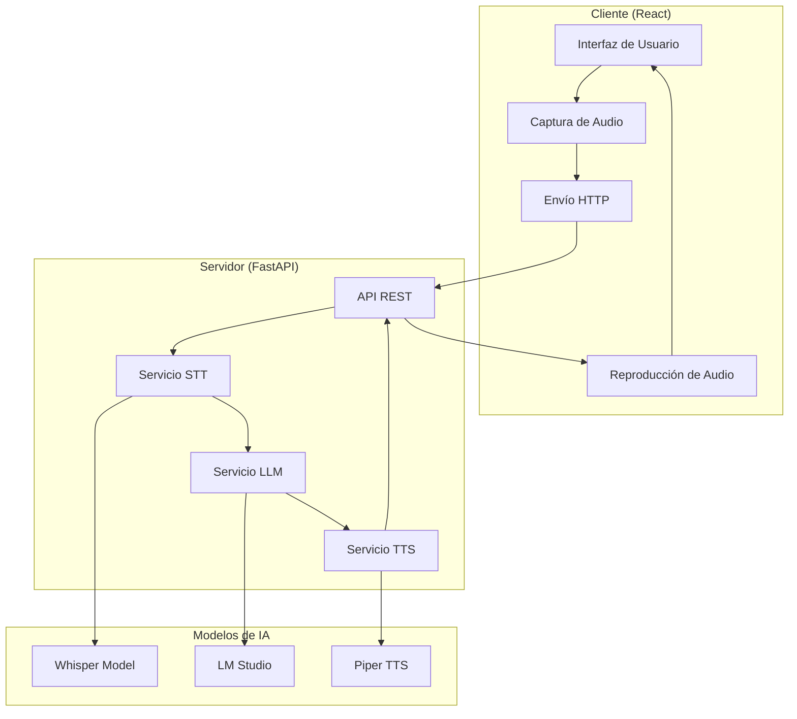

# Detalles Técnicos de Jarv1s

## Arquitectura del Sistema

### Visión General
Jarv1s implementa una arquitectura cliente-servidor desacoplada que separa claramente la interfaz de usuario del procesamiento de IA. Esta separación permite escalabilidad, mantenibilidad y la posibilidad de usar diferentes frontends.



## Componentes del Backend

### 1. API REST (FastAPI)

**Archivo**: `src/api/server.py`

La API expone un endpoint principal `/interact` que maneja todo el flujo conversacional:

```python
@app.post("/interact")
async def interact_endpoint(audio: UploadFile = File(...)):
    # 1. Procesar audio de entrada
    # 2. Transcribir con Whisper
    # 3. Generar respuesta con LLM
    # 4. Sintetizar voz con Piper
    # 5. Retornar audio codificado en base64
```

**Características técnicas**:
- Manejo asíncrono de requests
- Validación de tipos de archivo de audio
- Gestión de errores robusta
- CORS habilitado para desarrollo

### 2. Servicio Speech-to-Text

**Archivo**: `src/services/stt_service.py`

Utiliza OpenAI Whisper para transcripción de audio:

```python
class STTService:
    def __init__(self):
        self.model_name = "small"  # Balance entre precisión y velocidad
        
    def transcribe(self, audio_file_path: str) -> str:
        # Carga dinámica del modelo para evitar conflictos de memoria
        model = whisper.load_model(self.model_name)
        result = model.transcribe(audio_file_path)
        del model  # Liberación explícita de memoria
        return result["text"].strip()
```

**Optimizaciones implementadas**:
- **Carga dinámica**: El modelo se carga solo cuando es necesario
- **Liberación de memoria**: Previene conflictos con otros componentes
- **Modelo "small"**: Mejor balance precisión/velocidad que "base"
- **Preprocesamiento de audio**: Conversión automática de formatos

### 3. Servicio LLM

**Archivo**: `src/services/llm_service.py`

Gestiona la comunicación con el modelo de lenguaje local:

```python
class LLMService:
    def __init__(self):
        self.conversation_history = []
        self.model_name = "openai/lmstudio-local-model"
        self.api_base = "http://localhost:1234/v1"
        
    def think(self, user_input: str) -> str:
        # Agregar mensaje del usuario al historial
        self.conversation_history.append({
            "role": "user", 
            "content": user_input
        })
        
        # Generar respuesta con contexto completo
        response = litellm.completion(
            model=self.model_name,
            messages=self.conversation_history,
            api_base=self.api_base
        )
        
        # Agregar respuesta al historial
        assistant_response = response.choices[0].message.content
        self.conversation_history.append({
            "role": "assistant",
            "content": assistant_response
        })
        
        return assistant_response
```

**Características clave**:
- **Memoria conversacional**: Mantiene historial completo de la conversación
- **Compatibilidad OpenAI**: Usa LiteLLM para abstracción de APIs
- **Configuración flexible**: Fácil cambio de modelos y endpoints

### 4. Servicio Text-to-Speech

**Archivo**: `src/services/tts_service.py`

Implementa síntesis de voz usando Piper TTS:

```python
class TTSService:
    def __init__(self):
        model_path = "models/tts/es_ES-sharvard-medium.onnx"
        config_path = "models/tts/es_ES-sharvard-medium.onnx.json"
        self.voice = PiperVoice.load(model_path, config_path=config_path)
        
    def speak(self, text: str) -> bytes:
        # Generar audio PCM
        audio_data = b''
        for audio_bytes in self.voice.synthesize_stream_raw(text):
            audio_data += audio_bytes
            
        # Convertir a WAV válido
        return self._create_wav_file(audio_data)
```

**Ventajas de Piper TTS**:
- **Alta calidad**: Voz natural y clara
- **Baja latencia**: Síntesis rápida en CPU
- **Streaming**: Generación de audio por chunks
- **Múltiples idiomas**: Soporte para español nativo

## Componentes del Frontend

### 1. Interfaz Principal

**Archivo**: `frontend/src/App.tsx`

Implementa una interfaz minimalista centrada en la conversación:

```typescript
const App = () => {
  const [isRecording, setIsRecording] = useState(false);
  const [isProcessing, setIsProcessing] = useState(false);
  
  const handleSpacePress = useCallback((event: KeyboardEvent) => {
    if (event.code === 'Space' && !isProcessing) {
      event.preventDefault();
      if (!isRecording) {
        startRecording();
      }
    }
  }, [isRecording, isProcessing]);
  
  // Lógica de grabación y comunicación con backend
};
```

**Características de UX**:
- **Push-to-talk**: Mantener espacio para grabar
- **Feedback visual**: Animaciones que indican estado
- **Gestión de estados**: Recording → Processing → Ready

### 2. Captura de Audio

Utiliza la MediaRecorder API nativa del navegador:

```typescript
const startRecording = async () => {
  const stream = await navigator.mediaDevices.getUserMedia({ 
    audio: {
      sampleRate: 16000,
      channelCount: 1,
      echoCancellation: true,
      noiseSuppression: true
    }
  });
  
  const mediaRecorder = new MediaRecorder(stream, {
    mimeType: 'audio/webm;codecs=opus'
  });
  
  // Configuración de eventos y grabación
};
```

## Flujo de Datos Detallado

### 1. Captura de Audio (Frontend)
- Usuario presiona espacio
- MediaRecorder inicia captura en formato WebM
- Audio se almacena en chunks

### 2. Envío al Backend
- Audio se convierte a Blob
- Se envía via POST a `/interact`
- Backend recibe UploadFile

### 3. Procesamiento STT
- Audio WebM se convierte a WAV con FFmpeg
- Whisper transcribe el audio a texto
- Texto se limpia y valida

### 4. Procesamiento LLM
- Texto se agrega al historial conversacional
- Se envía contexto completo a LM Studio
- LLM genera respuesta coherente

### 5. Síntesis TTS
- Texto de respuesta se procesa con Piper
- Se genera audio PCM de alta calidad
- Audio se convierte a formato WAV válido

### 6. Respuesta al Frontend
- Audio se codifica en base64
- Se envía en respuesta JSON
- Frontend decodifica y reproduce audio

## Optimizaciones de Rendimiento

### Backend
- **Carga dinámica de modelos**: Evita conflictos de memoria
- **Streaming de audio**: Procesamiento por chunks
- **Caché de modelos TTS**: Voz cargada una sola vez
- **Gestión de memoria**: Liberación explícita de recursos

### Frontend
- **Debouncing**: Evita múltiples grabaciones simultáneas
- **Estados optimizados**: Minimiza re-renders innecesarios
- **Lazy loading**: Componentes cargados bajo demanda

## Configuración y Variables de Entorno

```bash
# .env
LLM_API_BASE=http://localhost:1234/v1
LLM_MODEL_NAME=openai/lmstudio-local-model
WHISPER_MODEL=small
TTS_MODEL_PATH=models/tts/es_ES-sharvard-medium.onnx
```

## Manejo de Errores

### Backend
- Validación de formatos de audio
- Timeouts para modelos de IA
- Logging detallado de errores
- Respuestas HTTP apropiadas

### Frontend
- Manejo de permisos de micrófono
- Retry automático en fallos de red
- Feedback visual de errores
- Degradación elegante de funcionalidad

## Métricas y Monitoreo

### Latencias Típicas (CPU Intel i7)
- **STT (Whisper small)**: ~2-3 segundos para 5s de audio
- **LLM (1B parámetros)**: ~1-2 segundos por respuesta
- **TTS (Piper)**: ~0.5-1 segundo por frase
- **Total end-to-end**: ~4-6 segundos

### Uso de Recursos
- **RAM**: ~2-4GB durante operación
- **CPU**: Picos del 80-100% durante procesamiento
- **Disco**: ~3GB para modelos base

## Seguridad

### Principios Implementados
- **Procesamiento local**: Sin envío de datos externos
- **Validación de entrada**: Verificación de tipos de archivo
- **Sanitización**: Limpieza de texto antes de TTS
- **Límites de recursos**: Timeouts y límites de tamaño

### Consideraciones Futuras
- Autenticación para acceso remoto
- Cifrado de datos sensibles
- Auditoría de acciones del sistema
- Sandboxing de herramientas externas